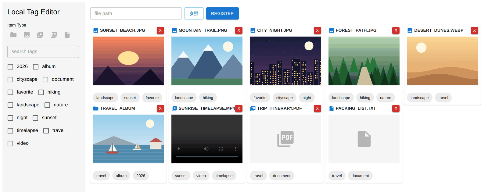
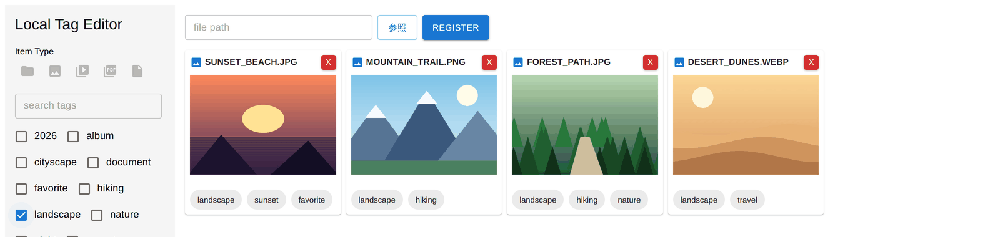
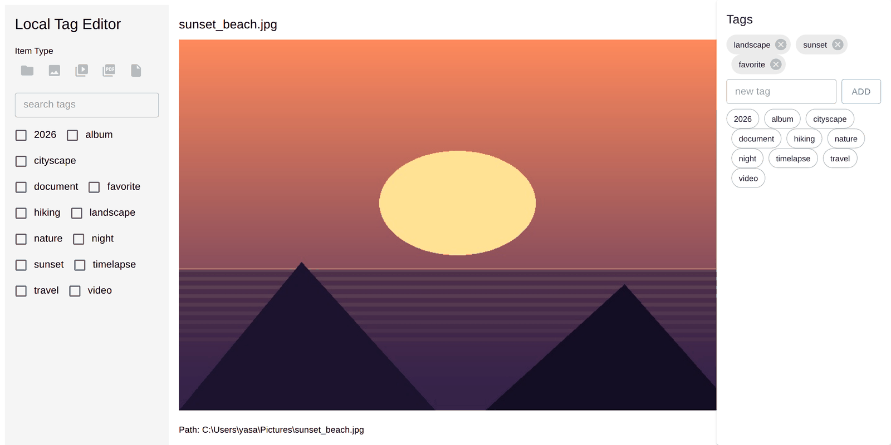
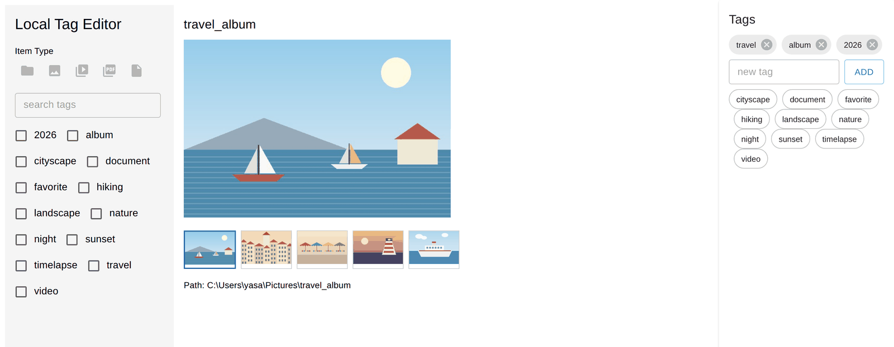
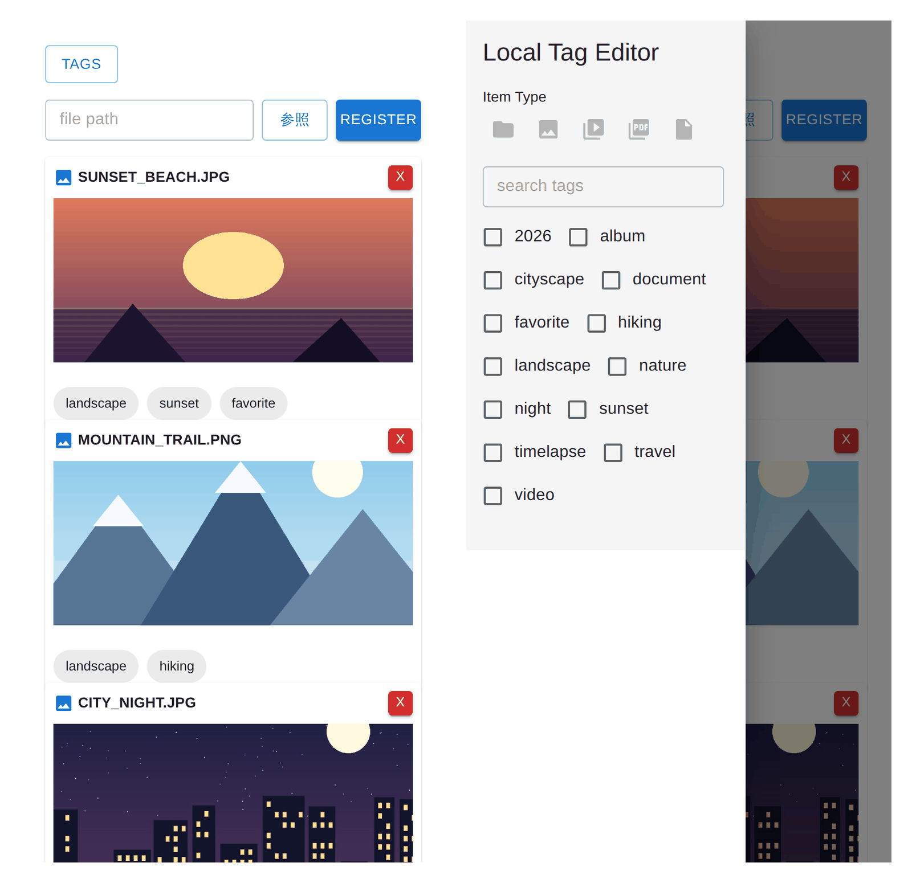

# LocalTagEditor

[](https://github.com/yasaims/LocalTagEditor/actions/workflows/ci.yml)

> [!CAUTION]
>
> - このアプリはローカルネットワーク内での利用を想定しています。信頼できないネットワーク（公衆Wi-Fi等）や、インターネットから到達可能なポートでは**絶対に**起動しないでください。

> [!CAUTION]
>
> - This app is intended for use on a trusted local network only. **Never** run it on an untrusted network (e.g. public Wi-Fi) or expose it to the internet.
> - Even when serving it on your LAN with `FLASK_HOST=0.0.0.0`, always keep `FLASK_DEBUG` set to `False` (the default). Leaving debug mode enabled while exposed on the LAN allows remote code execution (RCE) to anyone who can reach the port.
> - `WRITE_MODE=all` allows any device on the network to register/delete files, not just the local machine. Only use it in an environment you fully trust.
> - The backend never manages file contents itself — it resolves registered paths (`File.path`) directly against the filesystem it runs on. Who can reach the app depends entirely on your router/firewall configuration, so manage exposure at your own responsibility.

This repository contains a simple tag-based file manager that runs entirely on a local machine.

- **Backend:** Python + Flask
- **Database:** SQLite via SQLAlchemy
- **Frontend:** React
- **Supported image formats:** PNG, JPG, JPEG, GIF, WEBP
- **Supported video formats:** MP4, WEBM, OGG

## Screenshots

The screenshots below were taken against sample files; the artwork in them is
generated placeholder graphics, not real photos.

### Library

Registered files are shown as a grid of thumbnails. Images and videos are
previewed inline, while folders fall back to the first media file inside them
and other types show an icon for their kind. The path bar at the top only
appears when the connection is allowed to register files (see `WRITE_MODE`).



### Filtering by tag and item type

Ticking tags in the sidebar narrows the list to files carrying *all* of the
selected tags; the icon row above it filters by item type on top of that.



### File detail and tagging

Opening a file shows a full-size preview with its tags on the right. Tags can
be typed in, added with one click from the list of existing tags, or removed
from the chip itself.



### Folders

A registered folder is browsed as a set: the thumbnail strip switches the
preview, and clicking the left or right half of the preview steps through the
items.



### On a smartphone

On narrow screens the sidebar collapses into a drawer opened by the **Tags**
button.



## Setup

### Backend

```bash
cd backend
python -m venv venv
# On Windows use: venv\Scripts\activate
source venv/bin/activate
pip install -r requirements.txt
# Optional: copy `backend/.env.example` to `backend/.env` to configure the server
cp backend/.env.example backend/.env
python app.py
```

### Frontend

```bash
cd frontend
npm ci
```

To start the development server so that other devices can access it:

```bash
cp frontend/.env.example frontend/.env
# Edit frontend/.env and replace <PC_IP> with the IP address of your PC
npm start
```

Create the `.env` file the same way on Windows.

Now open `http://<PC_IP>:3000` on your smartphone browser to use the app.

## Checks

Every push and pull request runs [the CI workflow](.github/workflows/ci.yml).
The same checks can be run locally.

### Backend

```bash
cd backend
pip install -r requirements-dev.txt
ruff check .            # lint
ruff format --check .   # formatting
pytest                  # API tests
flask db check          # models and migrations agree
```

### Frontend

```bash
cd frontend
CI=true npm run build   # CI=true turns ESLint warnings into build errors
```
